  

  
  
  

---

### 🚀 Sobre mim

Sou desenvolvedor **Mobile & Full Stack Pleno**, construindo produtos web e mobile desde 2022.
Fora do trabalho, crio e publico **meus próprios apps na App Store**, cuidando de tudo: app, API, banco, deploy e publicação.

- 📱 **Foco:** apps mobile com React Native / Expo e APIs com NestJS + Prisma
- 🎓 **Formação:** Sistemas de Informação, PUCPR (2022–2025)
  
---

### 📱 Apps publicados

| App | O que faz | Stack | Download |
| --- | --- | --- | --- |
| **Soma** | Nutrição e macros: refeições, receitas e insights de alimentação com IA | Expo · NestJS · Prisma · PostgreSQL · Claude API | [App Store](https://apps.apple.com/us/app/soma-food-tracker/id6761935731) |
| **Heisen** | Treino sério: rotinas semanais, séries, cargas e progresso | Expo · NestJS · Prisma | [App Store](https://apps.apple.com/us/app/heisen/id6759606396) |
| **Nara** | Tarefas com estratégia: prioridades, subtarefas e lembretes (iOS + Mac) | Expo · Electron · React | [App Store](https://apps.apple.com/us/app/nara-app/id6759169299) |

> Os três formam o ecossistema **GB Apps** (fitness, produtividade e alimentação), com plano de integração entre os produtos.

---

### 💼 Experiência

**Vcodes** · Dev Mobile & Full Stack Pleno · *jun/2025 – presente* 
Produtos digitais em startup: aplicações mobile, web e desktop.

**Embarca** · *mai/2024 – jun/2025* 
↳ Dev Mobile & Full Stack Pleno · *abr/2025 – jun/2025* 
↳ Dev Mobile & Full Stack Júnior · *mai/2024 – abr/2025* 
Front-end da plataforma [Embarca.ai](https://embarca.ai) de venda de passagens de ônibus (React, Next.js).

**Agência Chleba** · *set/2022 – abr/2024* 
↳ Dev Full Stack Júnior · *fev/2024 – abr/2024* 
↳ Estágio em Desenvolvimento · *set/2022 – fev/2024* 
Landing pages para clientes como a Plaenge, com foco em performance, responsividade e UX/UI.

---

### 🛠️ Stack

  

**Mobile:** React Native · Expo · Expo Router · React Query · NativeWind 
**Frontend:** React · Next.js · TypeScript · Tailwind · Framer Motion · Three.js 
**Backend:** Node.js · NestJS · Express · Prisma · PostgreSQL · MySQL · MongoDB 
**Outros:** Docker · Electron / Tauri · Stripe · Cypress · Figma

---

### ⭐ Projetos em destaque

| Projeto | Descrição | Stack |
| --- | --- | --- |
| [**Portfólio**](https://github.com/gustavobordig/new-portifolio) · [demo](https://new-portifolio-azure.vercel.app) | Portfólio com tema espacial, cenas 3D e i18n (PT/EN) | Next.js · Three.js · Framer Motion |
| [**ePonto (TCC)**](https://github.com/gustavobordig/eponto-tcc) · [demo](https://eponto-ten.vercel.app) | Ponto eletrônico com banco de horas, férias e dashboard de RH | Next.js 15 · Recharts · Cypress |
| [**Soma**](https://apps.apple.com/us/app/soma-food-tracker/id6761935731) · código privado | App de nutrição com IA: análise de refeições por foto e geração de plano alimentar com Claude, API própria e login social (Apple/Google) | Expo · NestJS · Prisma · PostgreSQL · Claude API |

---

  <i>Construindo apps que resolvem a rotina, um produto de cada vez.</i>

